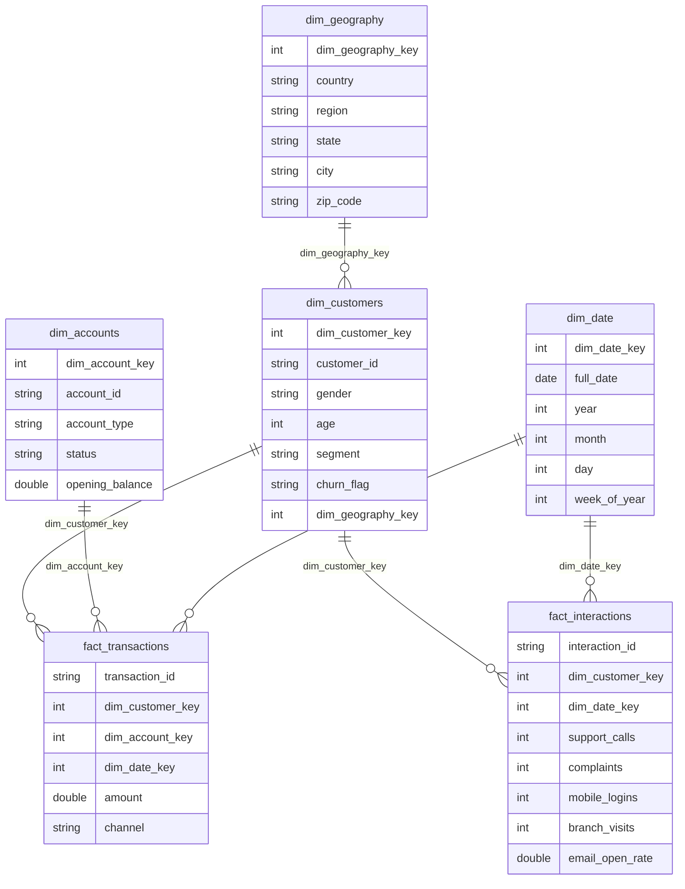

# 📉 Customer Churn Data Pipeline (Medallion Architecture — Databricks + Delta Lake)

This project implements a complete Medallion Architecture (Bronze → Silver → Gold) data pipeline for a **Customer Churn Analytics** use case. The goal is to transform raw banking/customer datasets into clean, conformed, analytics-ready Delta tables that support churn prediction, customer segmentation, and behavioral insights. A separate Power BI project will connect to the **Gold layer tables** to create dashboards and KPIs.

---

## 🧩 1. Business Problem

Financial institutions lose millions each year due to customer churn. Key questions include:

- Which customers are most likely to churn?
- What behavioral patterns indicate churn risk?
- Which regions, segments, or age groups churn the most?
- How does transaction behavior relate to churn?
- How do we segment customers by value and engagement?

This project builds the **data foundation** required to answer these questions by creating a structured, validated, analytics-ready dataset.

---

## 🏗️ 2. Project Objective

The pipeline prepares data for advanced churn analytics by:

- Ingesting multiple raw customer datasets  
- Cleaning, validating, and standardizing the data  
- Establishing keys and relationships across entities  
- Modeling dimensions, fact tables, and business aggregations  
- Producing business-ready tables for BI and ML workflows  

This is done following **Delta Lake’s Medallion Architecture** using Databricks.

---

## 🔷 3. Medallion Architecture (Bronze → Silver → Gold)

```mermaid
flowchart LR
    A[Raw CSV Data] --> B[Bronze<br/>Raw Delta Tables]
    B --> C[Silver<br/>Cleaned & Conformed Data]
    C --> D[Gold<br/>Dimensional Models & Aggregations]
    D --> E[Power BI (Separate Project)]
```

---

## 📚 4. Notebooks & Their Purpose

This repository contains three notebooks, each representing a Medallion layer.

---

### 🟫 4.1 Bronze Layer — Raw Data Ingestion (`bronze_notebook.ipynb`)

The Bronze layer stores raw data exactly as received, preserving lineage.

**This notebook:**

- Reads raw CSV datasets:
  - Customers  
  - Accounts  
  - Transactions  
  - Interactions  
- Applies schema-on-read  
- Loads raw data into **Bronze Delta tables**  
- Performs **no business transformations**

**Purpose:**  
Create an immutable **single source of truth** for all raw customer and transactional data.

---

### ⬜ 4.2 Silver Layer — Data Cleaning & Standardization (`silver_notebook.ipynb`)

The Silver layer ensures trustworthy, consistent, analytics-ready data.

**This notebook:**

- Loads Bronze tables into PySpark  
- Handles:
  - Null values  
  - Deduplication  
  - Data type enforcement  
- Standardizes categorical fields  
- Fixes referential integrity across:
  - Customers ↔ Accounts  
  - Accounts ↔ Transactions  
- Produces conformed **Silver Delta tables**

**Purpose:**  
Turn raw operational data into reliable, **clean, conformed** datasets.

---

### 🟨 4.3 Gold Layer — Business Models & Aggregations (`gold_notebook.ipynb`)

The Gold layer structures the data for analytics, BI, segmentation, and churn KPIs.

**This notebook builds:**

#### **Dimension Tables**
- `dim_customers`  
- `dim_accounts`  
- `dim_geography`  
- `dim_date`  

#### **Fact Tables**
- `fact_transactions`  
- `fact_interactions`  

#### **Aggregated BI Tables**
- `agg_customer_rfm` — Recency, Frequency, Monetary scoring  
- `customer_churn_segmentation`  
- `agg_geography_summary`  
- `agg_date_summary`  

**Purpose:**  
Provide **business-ready data models** for dashboards, churn analytics, and operational insights.

---

### ⬜ 4.4 ER Diagram



---

## ⬜ 5. Repository Structure

```
📦 churn-medallion-pipeline/
│
├── bronze_notebook.ipynb     # Raw ingestion → Bronze
├── silver_notebook.ipynb     # Cleaning & conformance → Silver
├── gold_notebook.ipynb       # Business modeling → Gold
└── README.md                 # Project documentation
```

---

## 📈 6. Insights This Pipeline Enables

Once connected to Power BI, this pipeline enables:

### ✔ **Churn Risk Identification**
- Based on recency, engagement, frequency, and transactional activity  
- Detect customers showing signs of decreased activity or dropping engagement  

### ✔ **Customer Segmentation**
- Value tiers (high-value, medium-value, low-value)  
- Inactivity and dormant segments  
- Behavior- and value-based clusters  

### ✔ **Behavioral Trend Analysis**
- Daily, weekly, and monthly transaction patterns  
- Time-based engagement and spending trends  

### ✔ **Geographic Performance**
- Regional churn analysis  
- Customer concentration by region  
- Location-based profitability and retention metrics  

### ✔ **Account & Transaction Insights**
- Spending patterns and transaction intensity  
- Preferred channels  
- Account-level activity and performance metrics  

---

## 🧰 7. Technologies Used

- **Databricks (PySpark + SQL)**  
- **Delta Lake (Bronze, Silver, Gold)**  
- **Spark DataFrames**  

- **Lakehouse Architecture**  
- **Dimensional Modeling / Star Schema**  
- **Business Intelligence Concepts**  
- External: **Power BI** (visualization in a separate repository)

---

## 🎯 8. Summary

This project demonstrates a complete **data engineering pipeline** that prepares raw banking/customer data for churn analysis and BI reporting.

By following the **Medallion Architecture**, it ensures:

- Clean, reliable datasets  
- Strong relationships across customer, account, geographic, and date entities  
- Well-modeled tables optimized for analytics  
- Scalable transformations suitable for enterprise workloads  

A separate Power BI project will visualize the results using the **Gold-layer outputs** from this pipeline.
